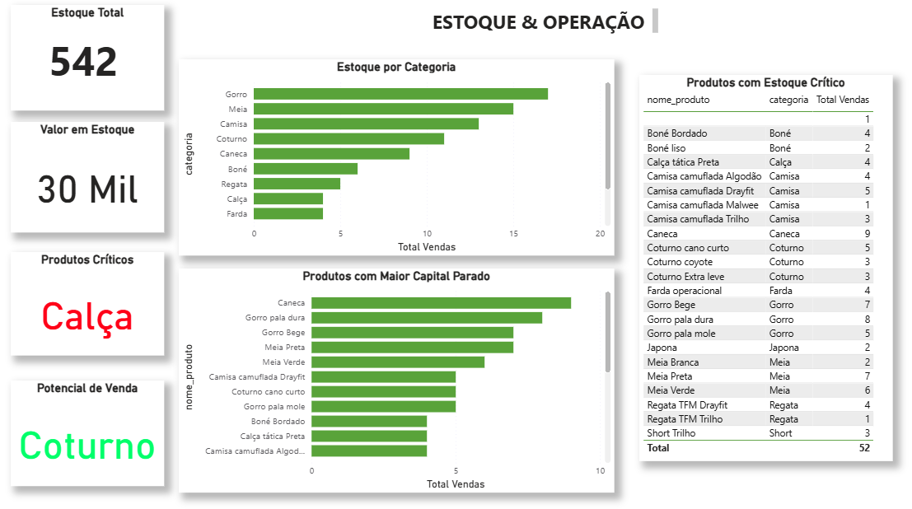

# Solução de Business Intelligence para Gestão Comercial no Varejo

## 🔎 Navegação Rápida
- [Visão Geral](#visão-geral)
- [Contexto do Problema](#contexto-do-problema)
- [Stack Técnica](#stack-técnica)
- [Arquitetura da Solução](#arquitetura-da-solução)
- [Visualização Estratégica e KPIs](#visualização-estratégica-e-kpis)
- [Competências Técnicas](#competências-técnicas-aplicadas)
- [Conclusão](#conclusão)

---

## Visão Geral

Esta solução foi desenvolvida para estruturar e automatizar o processo de gestão comercial de uma operação de varejo, substituindo processos manuais por uma aplicação centralizada em Streamlit e uma arquitetura de dados voltada à análise.

A evolução do sistema permitiu a implementação de um fluxo de dados mais confiável, com suporte a transações multi-itens, padronização na origem e geração de uma base analítica estruturada para consumo em ferramentas de Business Intelligence.

---

## ⚠️ Confidencialidade

Todas as imagens, valores e indicadores apresentados neste documento utilizam dados fictícios, com o objetivo de preservar informações sensíveis da operação real.

---

## Contexto do Problema

O processo anterior baseado em formulários apresentava limitações como:

- baixa estruturação dos dados  
- dificuldade no registro de múltiplos produtos por venda  
- inconsistências na consolidação para análise  

Para resolver esse cenário, foi desenvolvida uma aplicação em Streamlit que centraliza o registro de vendas e estrutura os dados já na origem.

---

## Stack Técnica

- Interface de Ingestão: Streamlit (Python)  
- Armazenamento: CSV (camada transacional)  
- Processamento de Dados: Python (Pandas)  
- Modelagem de Dados: SQL (modelo dimensional)  
- Visualização: Power BI  

---

## Arquitetura da Solução

👉 A estrutura técnica completa pode ser consultada aqui:  
[📄 Arquitetura da Solução](docs/arquitetura_solucao.md)

---

### 1. Camada de Ingestão (Streamlit)

Aplicação responsável pelo registro operacional das vendas:

- suporte a múltiplos produtos por transação  
- cálculo automático de valores  
- geração de identificador único (id_venda)  
- padronização de entrada de dados  

📌 Interface do sistema (dados fictícios):

---

### 2. Camada de Processamento e Padronização (Python - ETL)

Responsável pela preparação e qualidade dos dados:

- padronização de colunas  
- tratamento de tipos de dados  
- remoção de inconsistências  
- validação de integridade  
- criação de variáveis temporais  

👉 Detalhes técnicos:
[📄 Estrutura do Projeto](docs/estrutura_projeto.md)

---

### 3. Camada de Dados (CSV)

Base transacional utilizada no pipeline:

- registro de vendas  
- histórico operacional  
- base para ETL  

---

### 4. Camada de Modelagem (SQL)

Estrutura analítica baseada em modelo dimensional (Star Schema):

- consultas por produto, vendedor e período  
- agregações de vendas  
- suporte a KPIs  

👉 Consultas SQL:
[📄 Queries SQL](sql/queries.sql)

📌 Modelagem de dados (dados fictícios):

---

### 5. Camada de Visualização (Power BI)

Dashboards estratégicos para análise de negócio.

---

## Visualização Estratégica e KPIs

---

### Visão Executiva

Indicadores principais do negócio:

- Receita total  
- Ticket médio  
- Volume de vendas  
- Evolução temporal  

📌 Dashboard Executivo (dados fictícios):

---

### Análise de Produtos

Foco em portfólio e desempenho:

- produtos mais vendidos  
- giro de estoque  
- contribuição por produto  
- análise de mix  

📌 Dashboard Produtos (dados fictícios):

---

### Performance Comercial

Análise da equipe de vendas:

- ranking de vendedores  
- volume por colaborador  
- performance individual  
- contribuição para faturamento  

📌 Dashboard Vendedores (dados fictícios):

---

### Visão Operacional

Monitoramento da operação:

- volume de transações  
- comportamento de compra  
- análise diária da operação  

📌 Dashboard Operação (dados fictícios):

---

## Competências Técnicas Aplicadas

- Desenvolvimento de aplicações com Streamlit  
- Engenharia de dados com Python (Pandas)  
- Processos de ETL e padronização de dados  
- Modelagem relacional e dimensional (SQL)  
- Construção de dashboards com Power BI  
- Definição e análise de KPIs  

---

## 📚 Documentação Técnica

- [Arquitetura da Solução](docs/arquitetura_solucao.md)  
- [Estrutura do Projeto](docs/estrutura_projeto.md)  
- [Dicionário de Dados](docs/dicionario_dados.md)  

---

## Conclusão

Este projeto demonstra a capacidade de transformar uma operação comercial por meio de tecnologia. A evolução da ferramenta de coleta destaca o foco na qualidade do dado e na escalabilidade da solução analítica, consolidando competências essenciais para um profissional de Dados e BI.

---

**Autor:** Thiago Ferreira
